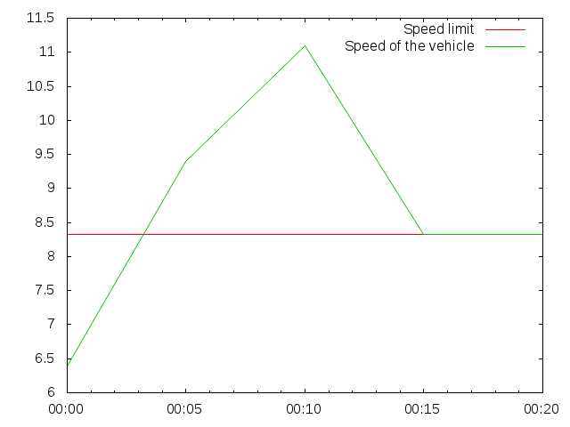

# A solution to the Waypoints challenge

## Installation
This solution is written in Ruby.  It should be enough to have RSpec installed
and run `rspec` in the top-level directory (here) to see the main test cases;
if needed, a Gemfile is provided, so that one can run `bundle` to install the
appropriate dependencies.

The solution is the last entry in the spec file, that calls `#map` and
`#reduce` on the main class, with the data provided.  We find the following
results, rounded to two decimals:

  * Duration spent speeding: 11.76s
  * Distance covered while speeding: 115.40m
  * Total duration: 20s
  * Total distance covered: 180.9m

## How it works
I’ve taken the view that a linear interpolation of the speed between two
waypoints provides a sensible model, as the time elapsed between two
consecutive waypoints will usually be very short.  In this case the interval is
5 seconds, so it certainly fits the expectation.  The speed is thus given by
this graph:

This is equivalent to saying that the acceleration *a* is constant between two
waypoints.  If we denote by *s*0 and *t*0 the speed and
time at the first waypoint, and *s*1 and *t*1 the speed
and time at the second one, the acceleration is the slope between these two
points:

  *a* = (*s*1 - *s*0)
  / (*t*1 - *t*0)

The speed at time *t* can thus in turn be expressed as

  *s*(*t*) = ∫*t*0*a* d*t*
  = *a* × (*t* - *t*0) + *s*0

or alternatively, using the other waypoint as reference

  *s*(*t*) = ∫*t*1*a* d*t*
  = *a* × (*t* - *t*1) + *s*1

If *s*0 and *s*1 are on different sides of the speed
limit *s**ℓ*, the speed *s* will reach *s**ℓ* at time
*t**ℓ* such that

  *s*(*t**ℓ*) = *s**ℓ*
  ⇔ *a* × (*t*ℓ - *t*0) + *s*0 = *s**ℓ*
  ⇔ *t*ℓ - *t*0 = (*s**ℓ* - *s*0) / *a*
  ⇔ *t*ℓ = *t*0 + (*s**ℓ* - *s*0) / *a*

or, using the other waypoint:

*t*ℓ = *t*1 + (*s**ℓ* - s1) / *a*

This allows us to calculate for how long the driver was over the speed limit
(if at all).  In the code we use the variable *dur* to calculate the relative
duration rather than absolute times; this is what is interesting to us.

We also want to calculate the distance covered while speeding, this can again
be done by integrating:

  *dist* = ∫*t**ℓ**s*(*t*) d*t*
  = ∫*t**ℓ*(*s*ℓ + *at*) d*t*
  = *s**ℓ*(*t* - *t**ℓ*) + *a* × (*t* - *t**ℓ*)2 / 2
  = (*s**ℓ* + *a* × (*t* - *t**ℓ*) / 2) × (*t* - *t**ℓ*)

and at that point of the code *t* - *t**ℓ* will be assigned to
*dur*, hence

  *dist* = (*s**ℓ* + *a* × *dur* / 2) × *dur*

We have a similar formula for the total distance covered (regardless of whether
the driver was speeding or not).

The code needs to check that the correct conditions are fulfilled before
applying these formulæ, and the tests specify special cases that need to be
covered (when acceleration is 0, etc.)  One case that is not covered is when
the speed limit is different at both waypoints: in this case, the code will
return results that are possibly inconsistent.  This doesn’t however happen
with the data provided.
